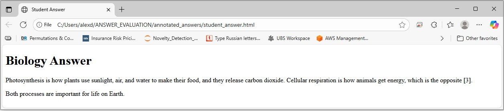
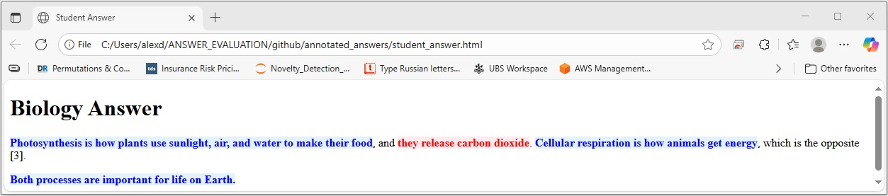

# Student Answer Evaluator

### What this does (high level, for non-technical readers)
This tool quickly reviews a student’s answer and visually marks what’s right and what’s wrong. It compares the student’s response to a trusted reference answer and:
- Highlights correct parts in blue
- Highlights incorrect parts in red

You can open the student’s page in a browser and instantly see which phrases are correct or need correction. This helps teachers and reviewers save time, and gives students clear, actionable feedback.

### Example
- Question: “What are the main differences between photosynthesis and cellular respiration?”
- The tool analyzes the student’s answer against a reference explanation and labels each sentence segment as correct or incorrect.

Below is the input and the AI’s structured output. ‘full’ is the whole sentence, ‘part’ is the specific phrase within that sentence, and ‘label’ says whether that phrase is correct or incorrect.

```python
question = "What are the main differences between photosynthesis and cellular respiration?"

golden_reference = """
Photosynthesis uses light energy, water, and carbon dioxide to produce glucose (sugar) and oxygen, storing energy in chemical bonds. Cellular respiration uses glucose and oxygen to release energy (ATP), producing carbon dioxide and water, and releasing heat.
"""

student_html_answer = """
<!DOCTYPE html>
<html>
<head>
    <title>Student Answer</title>
    </head>
<body>
    <h1>Biology Answer</h1>
    <p>Photosynthesis is how plants make food using sunlight, water, and CO2, releasing oxygen. Cellular respiration is how animals get energy, which is the opposite [3].</p>
    <p>Both processes are important for life on Earth.</p>
</body>
</html>
"""
```

LLM output (structured):
```json
{
  "sentences": [
    {"full": "Photosynthesis is how plants use sunlight, air, and water to make their food, and they release carbon dioxide.", "part": "Photosynthesis is how plants use sunlight, air, and water to make their food", "label": "correct"},
    {"full": "Photosynthesis is how plants use sunlight, air, and water to make their food, and they release carbon dioxide.", "part": "they release carbon dioxide", "label": "incorrect"},
    {"full": "Cellular respiration is how animals get energy, which is the opposite [3].", "part": "Cellular respiration is how animals get energy", "label": "correct"},
    {"full": "Both processes are important for life on Earth.", "part": "Both processes are important for life on Earth.", "label": "correct"}
  ]
}
```

Original student answer:



Annotated student answer:



Annotated HTML (what you’ll see in a browser):
```html
<!DOCTYPE html>

<html>
<head>
<title>Student Answer</title>
</head>
<body>
<h1>Biology Answer</h1>
<p><span style="color: blue; font-weight: bold; background-color: #e3f2fd;">Photosynthesis is how plants use sunlight, air, and water to make their food</span>, and <span style="color: red; font-weight: bold; background-color: #ffebee;">they release carbon dioxide</span>. <span style="color: blue; font-weight: bold; background-color: #e3f2fd;">Cellular respiration is how animals get energy</span>, which is the opposite [3].</p>
<p><span style="color: blue; font-weight: bold; background-color: #e3f2fd;">Both processes are important for life on Earth.</span></p>
</body>
</html>
```

This script evaluates student answers in HTML format against a golden reference using OpenAI's GPT-4 model. It identifies correct and incorrect parts of the answer and highlights only the specific parts inside each sentence in the original HTML.

## Features

- ✅ Evaluates student HTML answers against golden references
- ✅ Uses OpenAI GPT-4 for intelligent evaluation
- ✅ Highlights correct parts in **BOLD BLUE**
- ✅ Highlights incorrect parts in **BOLD RED**
- ✅ Per-sentence JSON output with labels and minimal highlighted parts
- ✅ Handles full HTML web pages (not just simple paragraphs)
- ✅ Extracts and displays evaluation results
- ✅ Saves highlighted HTML to file

## Installation Instructions

### Prerequisites
- Python 3.8 or higher
- pip (Python package installer)
- Conda (optional, but recommended for better package management)

### Step 1: Create a Virtual Environment (Recommended)

#### Option A: Using Conda (Recommended)
```bash
# Create conda environment with Python 3.9
conda create -n answer_evaluator_env python=3.9

# Activate conda environment
conda activate answer_evaluator_env
```

#### Option B: Using Python venv
```bash
# Create virtual environment
python -m venv answer_evaluator_env

# Activate virtual environment
# On Windows:
answer_evaluator_env\Scripts\activate
# On macOS/Linux:
source answer_evaluator_env/bin/activate
```

### Step 2: Install Dependencies

#### If using Conda:
```bash
# Install dependencies using pip within conda environment
pip install -r requirements.txt
```

#### If using venv:
```bash
# Install dependencies
pip install -r requirements.txt
```

### Step 3: Verify Installation
```bash
# Make sure your environment is activated first
# For conda: conda activate answer_evaluator_env
# For venv: answer_evaluator_env\Scripts\activate (Windows) or source answer_evaluator_env/bin/activate (macOS/Linux)

python improved_answer_evaluator.py
```

## Usage

### Basic Usage (Programmatic)
```python
from improved_answer_evaluator import evaluate_student_answer

# Define your inputs
question = "What are the main differences between photosynthesis and cellular respiration?"

golden_reference = """
Photosynthesis uses light energy, water, and carbon dioxide to produce glucose (sugar) and oxygen, storing energy in chemical bonds. Cellular respiration uses glucose and oxygen to release energy (ATP), producing carbon dioxide and water, and releasing heat.
"""

student_html_answer = """
<!DOCTYPE html>
<html>
<head>
    <title>Student Answer</title>
</head>
<body>
    <h1>Biology Answer</h1>
    <p>Photosynthesis is how plants make food using sunlight, water, and CO2, releasing oxygen. Cellular respiration is how animals get energy, which is the opposite [3].</p>
    <p>Both processes are important for life on Earth.</p>
</body>
</html>
"""

# Run evaluation
result = evaluate_student_answer(question, golden_reference, student_html_answer)

if result:
    print("Evaluation Result:", result['evaluation_result'])
    print("Highlighted HTML:", result['highlighted_html'])
```

### Command-line Usage (Reads inputs from files)
By default, running the script reads inputs from:
- `questions/question.txt`
- `student_answers/student_answer.html`
- `golden_references/golden_reference.txt`

```bash
python improved_answer_evaluator.py
```

This will:
1. Run the evaluation on the example data
2. Display the evaluation results
3. Show extracted correct and incorrect parts
4. Save the highlighted HTML to `highlighted_answer.html`

Example of `__main__` flow in the script:

```python
file_path = "questions/question.txt"
with open(file_path, "r", encoding="utf-8") as f:
     question = f.read()

file_path = "student_answers/student_answer.html"
with open(file_path, "r", encoding="utf-8") as f:
     student_html_answer = f.read()

file_path = "golden_references/golden_reference.txt"
with open(file_path, "r", encoding="utf-8") as f:
     golden_reference = f.read()
```

## Input Requirements

### Question
- Plain text question that the student is answering

### Golden Reference
- Plain text containing the correct answer
- Should be comprehensive and accurate

### Student HTML Answer
- Full HTML web page format
- Can contain any HTML structure (head, body, paragraphs, headings, etc.)
- Should NOT contain images or tables (as specified)
- Text content will be extracted and evaluated

## Output

The script returns a dictionary containing:
- `evaluation_result`: Raw LLM output (JSON per schema below)
- `highlighted_html`: Original HTML with correct parts in **BOLD BLUE** and incorrect parts in **BOLD RED**
- `correct_sentences`: Parts identified as correct (used for highlighting)
- `incorrect_sentences`: Parts identified as incorrect (used for highlighting)
- `student_plain_text`: Extracted plain text from student HTML

### LLM Response Schema
The evaluator asks the model to produce per-sentence labels. Preferred schema:

```json
{
  "sentences": [
    { "full": "<full sentence from student>", "part": "<minimal substring>", "label": "correct" | "incorrect" }
  ]
}
```

Legacy schema is still supported:

```json
{
  "Correct": [ { "part": "...", "full": "..." } ],
  "incorrect": { "part": "...", "full": "..." } | null
}
```

Notes:
- The highlighter colors only the `part` text inside the HTML.
- If a sentence has mixed claims, multiple entries may appear with the same `full` but different `part` and `label`.

## API Key Configuration

The script includes a pre-configured OpenAI API key. For production use, consider:

1. Using environment variables:
```python
import os
OPENAI_API_KEY = os.getenv('OPENAI_API_KEY')
```

2. Using a configuration file
3. Using secure key management services

## Troubleshooting

### Common Issues

1. **Import Errors**
   - Ensure all dependencies are installed: `pip install -r requirements.txt`
   - Check Python version (3.8+ required)

2. **API Key Issues**
   - Verify the OpenAI API key is valid
   - Check your OpenAI account has sufficient credits

3. **HTML Parsing Issues**
   - Ensure HTML is well-formed
   - Complex HTML structures are supported

4. **Memory Issues**
   - For very large HTML files, consider processing in chunks
   - Monitor memory usage with large documents

### Error Messages

- `Error during LLM evaluation`: Check API key and internet connection
- `Evaluation failed`: Review input data and try again

## Dependencies

- `beautifulsoup4`: HTML parsing and manipulation
- `langchain`: LLM integration framework
- `langchain-openai`: OpenAI integration for LangChain
- `openai`: OpenAI API client
- `lxml`: XML/HTML parser backend

## License

This project is provided as-is for educational purposes.

## Support

For issues or questions, please check:
1. Installation requirements
2. API key configuration
3. Input data format
4. Error messages in console output
